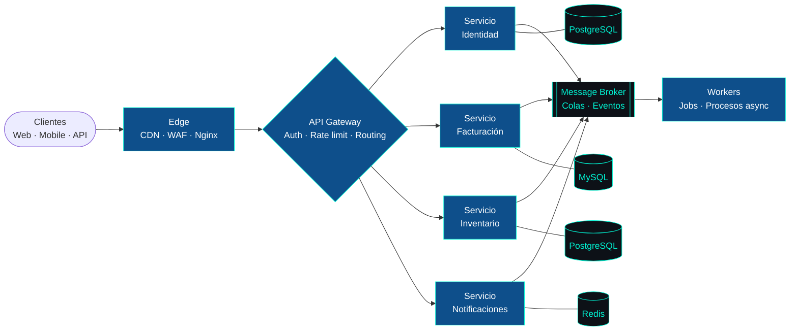

<div align="center">



<br/>

<a href="https://paolosolisg.github.io/paolosolisg/">
  
</a>

<br/><br/>

<a href="https://git.io/typing-svg">
  
</a>

</div>

---

## `> boot paolo.sys`

<div align="center">
  
</div>

---

## 🏗️ Cómo pienso la arquitectura



| Principio | En la práctica |
| --- | --- |
| 🔌 **Desacoplamiento** | Cada servicio con su dominio, su base de datos y su ciclo de despliegue |
| 📨 **Event-driven** | Comunicación asíncrona por eventos; los servicios no se esperan entre sí |
| 🧱 **Clean / Hexagonal** | El dominio no depende del framework, de la base de datos ni de la UI |
| 🏢 **Multi-tenant** | Aislamiento por empresa y sucursal, pensado desde el día uno |
| 🔁 **Resiliencia** | Reintentos, colas, idempotencia y fallos que no se propagan en cascada |
| 📈 **Escalabilidad** | Escalado horizontal, caché por capas y cuellos de botella medidos |

---

## 🖥️ Arquitectura de servidores

```text
┌──────────────────────────────────────────────────────────────┐
│  INTERNET                                                    │
│     │                                                        │
│  [ DNS · CDN · WAF ]                                         │
│     │                                                        │
│  [ Reverse Proxy · Nginx / Nginx Proxy Manager · SSL ]       │
│     │                                                        │
│  ┌──┴─────────────── VPS / Linux ──────────────────────┐     │
│  │  Docker · Compose · Redes aisladas                  │     │
│  │  ├─ app containers   (PHP-FPM · Node · .NET · JVM)  │     │
│  │  ├─ workers & queues (supervisor · schedulers)      │     │
│  │  ├─ databases        (MySQL · PostgreSQL · Redis)   │     │
│  │  └─ observabilidad   (logs · métricas · alertas)    │     │
│  └─────────────────────────────────────────────────────┘     │
│     │                                                        │
│  [ Backups automáticos · Hardening · Firewall · Fail2ban ]   │
└──────────────────────────────────────────────────────────────┘
```

---

## ⚔️ Arsenal

<div align="center">

<br/>
<br/>
<br/>
<br/>


</div>

---

## 🚀 Ecosistema Naniva

| Producto | Descripción |
| --- | --- |
| 🏢 **Naniva ERP** | ERP multiempresa y multisucursal para pymes peruanas |
| 🧾 **API de Facturación Electrónica** | Comprobantes SUNAT (UBL 2.1) como servicio independiente |
| 💬 **WhatsApp CRM** | Atención y seguimiento de clientes por WhatsApp |
| 🍽️ **Restaurantes** | Pedidos, mesas, cocina y caja en un solo sistema |

🌐 **[naniva.pe](https://naniva.pe)**

---

## 📊 Métricas

<div align="center">


</div>

---

## 📡 Contacto

<div align="center">

[](https://naniva.pe)
[](https://github.com/paolosolisg)
<!-- Descomenta y completa los que uses:
[](https://linkedin.com/in/TU-USUARIO)
[](mailto:TU-CORREO)
[](https://wa.me/51TU-NUMERO)
-->

</div>
